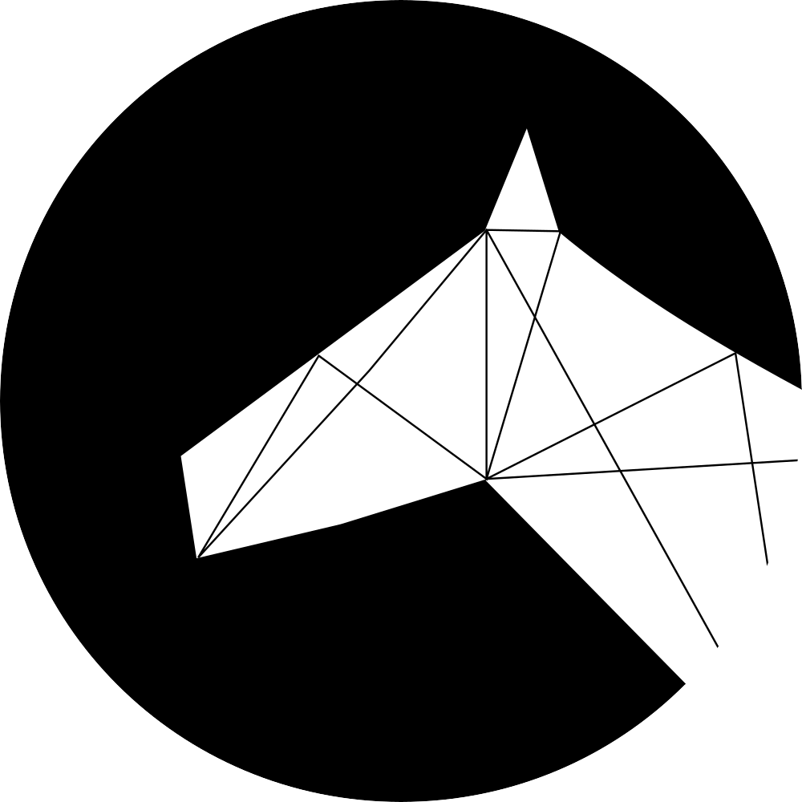
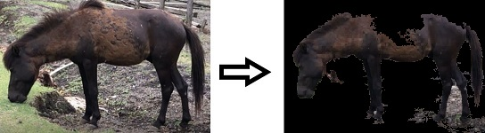
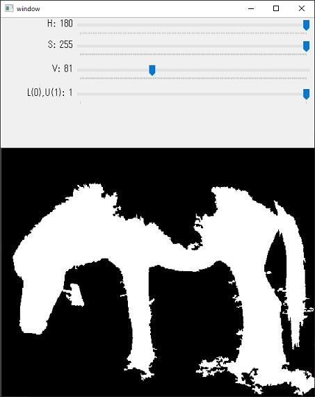
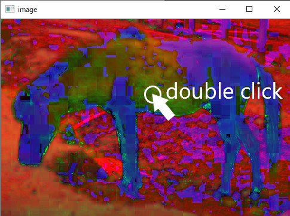
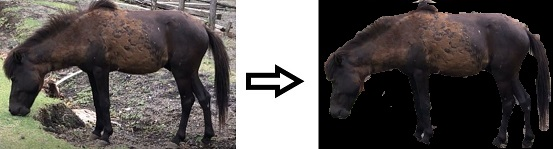
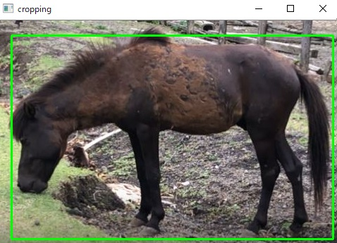
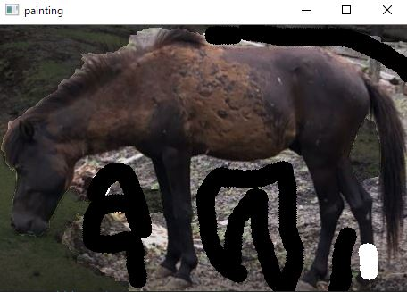
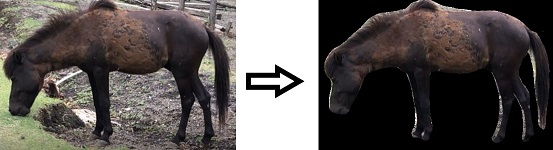

# Deep Beyond
<div align="center">
</img>
</div>

## 概要
馬の体格分析を行うことを目的


## 姿勢推定
深層学習によるセグメンテーションを応用して姿勢推定を行う。

### アルゴリズム
1. Deeplabv3を用いてマスクを生成
2. マスクから輪郭を生成、近似した輪郭を用いて姿勢推定を行う
3. 輪郭の線分の座標位置、角度から前足の線分の座標情報を抽出
4. 前足の線分情報を用いて前足の先端の頂点の中点を前足の軸とする
5. マスクによる輪郭とその中点を通る直線の交点を求める
6. 2つの交点からキ甲の長さを算出
7. 馬の尻側において正負正の順番で傾きが変化した場合、負の部分を胴の終点とする
8. キ甲のx座標と胴の終点から胴の長さを算出

## 仮想環境
```
conda env create --file env.yml
```
- python:3.8.13
- pytorch:1.11.0
- numpy:1.22.3
- pillow:9.0.1
- opencv:4.0.1

## 主な変更点
- (2022/6/23)：リポジトリ作成
- (2022/6/26)：深層学習プログラム作成
- (2022/6/28)：非深層学習プログラム（輪郭抽出、GrabCutアルゴリズムの対話プログラム）作成
- (2022/6/29)：姿勢推定プログラムを作成。前足を沿う直線の中線を前足の軸とした。
- (2022/6/30)：アルゴリズムをよりロバストに。前足の先端の頂点の中点を前足の軸とした
- (2022/7/1)
    - 外部から使用できるように全てのアプローチでクラス化。透過画像の出力が可能に
    - 誤差デルタを辞め、アルファ値を用いて輪郭とキ甲の直線の交点を求める
- (2022/7/7)：胴の検出が可能に,キ甲と胴の長さを算出可能
- (2022/7/12)
    - 馬尻の先端の検出が可能に
    - 引数の指定をymlファイルでも可能に
    - とも,首の検出が可能に
    - 結果をcsvファイルに保存可能に


<hr>

## segmentationアプローチ

<details>

<summary>
非深層学習ベース
</summary>

二値化・輪郭抽出による馬の領域抽出

[ソースコード：contour.py](./contour.py)
</summary>

トラックバーによって手動でマスクを設定

</img><br>
図１：非深層学習手法による出力結果比較

【トラックバー説明】<br>
**マスクを生成**

パラメーターによって二値化の範囲を設定
- 画面上部に操作パラメーター、画面下部に生成されるマスク
- HSVパラメーターと"モード"のパラメーターが存在
- "モード"は二値化の上限値or下限値の設定の2種類
- 二値化上限値設定モードがデフォルト
- Enterキーを押すとマスクを確定
- imageウィンドウに描画される図を**ダブルクリック**すると該当ピクセルの色を取得して二値化のパラメーターに反映

【注意】
マスクは被写体が白、それ以外は黒になるように生成する必要

</img><br>
図２：トラックバー

</img><br>
図３：imageウィンドウにおける色取得(表示される画像はHSV画像)


GrabCutによる馬の領域抽出
[ソースコード：grabcut.py](./grabcut.py)


</img><br>
図４：GrabCutアルゴリズムによる出力結果比較

1. バウンディングボックスによる領域選択
    マウス左クリックを押し続けてバウンディングボックスを作成

    </img><br>
    図５：アルゴリズム適用領域選択

2. ペイント操作によって領域修正<br>
    白色：未検出部分、黒色：誤検出部分<br>
    マウス左クリックで黒色、マウス右クリックで白色
    マウスホイール部をクリックして全体の処理を終了

    </img><br>
    図６：GrabCutアルゴリズムの出力に対する領域修正

【注意】全体の処理を終了させるにはペイント操作時にマウスホイール部をクリックする必要

</details>

<details>

<summary>深層学習ベース</summary>

## 深層学習ベース
[ソースコード：deep.py](./deep.py)

semantic segmentationによる馬の領域抽出

PyTorch Hubで配布されている**DEEPLABV3**を使用。
semantic segmentationを用いてマスクを生成して馬の領域の抽出を行う。

</img><br>
図７：深層学習手法による出力結果比較

</details>

## 参考サイト
- [GrabCutを使った対話的前景領域抽出](http://labs.eecs.tottori-u.ac.jp/sd/Member/oyamada/OpenCV/html/py_tutorials/py_imgproc/py_grabcut/py_grabcut.html)
- [DEEPLABV3](https://pytorch.org/hub/pytorch_vision_deeplabv3_resnet101/)
- [Deeplabv3-ResNet101でセマンティック・セグメンテーションをやってみる](https://kikaben.com/deeplabv3-resnet101-segmentation/)
- [OpenCV4Python10:OpenCV(numpy.ndarray)とPyTorch Hubで画像分類](https://note.com/fz5050/n/nfe3e087a8949)
- [Pythonでマスク画像を作る方法（３選）](https://water2litter.net/rum/post/python_image_mask/)
- [Semantic Segmentationの実装](https://qiita.com/MMsk0914/items/2f64a741e04b36cd1c76)

## LICENSE
[Apache License 2.0](./LICENSE)